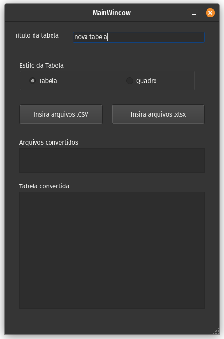

# Conversor de arquivos .csv e/ou .xlsx, em tabelas no formato LaTex

# Sobre o projeto

Programa com interface gráfica de conversão de arquivos .csv e/ou .xlsx, para um arquivo .tex com uma tabela em código no formato LaTex, conforme o usuário construiu no seu editor de planilhas eletrônica.

O programa consegue converter arquivos exportados no formatao .cvs, além de arquivos diretamente de planilha eletrônica no formato .xlsx

## Layout
   

## Funcionamento
1. Digitar o título da tabela;
2. Selecionar as opções entre tabela ou quadro;
3. Clicar o botão inserir arquivo .csv ou arquivo .xlsx;
4. Selecionar o arquivo por meio do gerencidor de arquivos do sistema operacional;
5. O código estará disponível na aplicação, e por meio de um arquivo .tex no mesmo local do arquivo convertido. 

## Tecnologias utilizadas
- C++;
- Qt 5;

### Biblioteca externa
- QtXlsx (leitura de dados em arquivos .xlsx)
A biblioteca pode ser encontrada em: https://github.com/dbzhang800/QtXlsxWriter

# Como executar o projeto
Requisitos:
- Compilador g++;
- Qt5 ou superior;
- Qt Creator;

Realizar o clone do projeto no GitHub
`git clone https://github.com/guilhermesetim/Conversor-Excel-CSV-to-Table-Latex.git`

Abrir o arquivo TableLatexMaker/TableLatexMaker.pro no Qt Creator

# Autor

Guilherme Setim